## 在 Windows 內安裝單機版 Ethereum 節點 Ganache

### 緣由

我們在進行以太坊智能合約開發時，因為部署到以太坊的主網相當花錢，且部署到以太坊測試網也會遇到效能問題（仍要等到區塊被挖出時才部署完成）或是隱私權問題（不想被別人看到自己的智能合約）。

而 Truffle 團隊為了此情況，有為以太坊社群的開發者釋出一套免費的單機版以太坊節點 Ganache。開發人員就可以透過 Ganache 進行安全且快速的以太坊智能合約開發。

而本文章即教大家如何在 Windows 作業系統上安裝 Ganache，並用 Metamask 錢包與 Ganache 連接，那麼就開始吧！

### （1）在作業系統中安裝 Google Chrome 瀏覽器。
https://www.google.com/chrome/?system=true&standalone=1&platform=win64

###（2）使用 Google Chrome 瀏覽器連線至 MetaMask 官網，並點選【GET CHROME EXTENSION】鈕
MetaMask 官網位址：https://metamask.io/


### （3）點選【+ 加到 CHROME】。


### （4）點選【新增擴充功能】將 MetaMask Chrome 擴充套件安裝好。

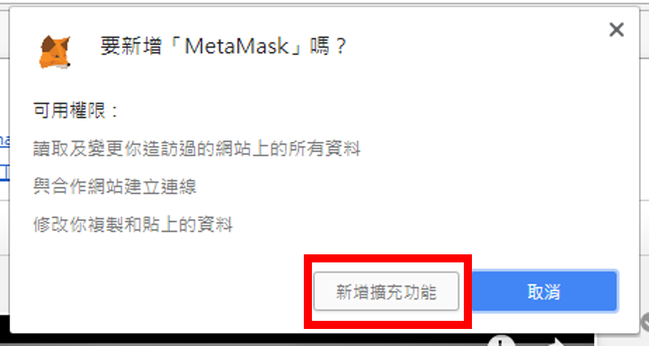

### （5）點選 Google Chrome 右上角【MetaMask】圖示來建立一組預設的私鑰及錢包。

接著閱讀完「使用條款」後（【捲軸】捲到最下方）→ 點選【Accept】。


### （6）再點選【Accept】同意「隱私聲明」。


### （7）接著閱讀完「網絡釣魚警告」後（【捲軸】捲到最下方）點選【Accept】。

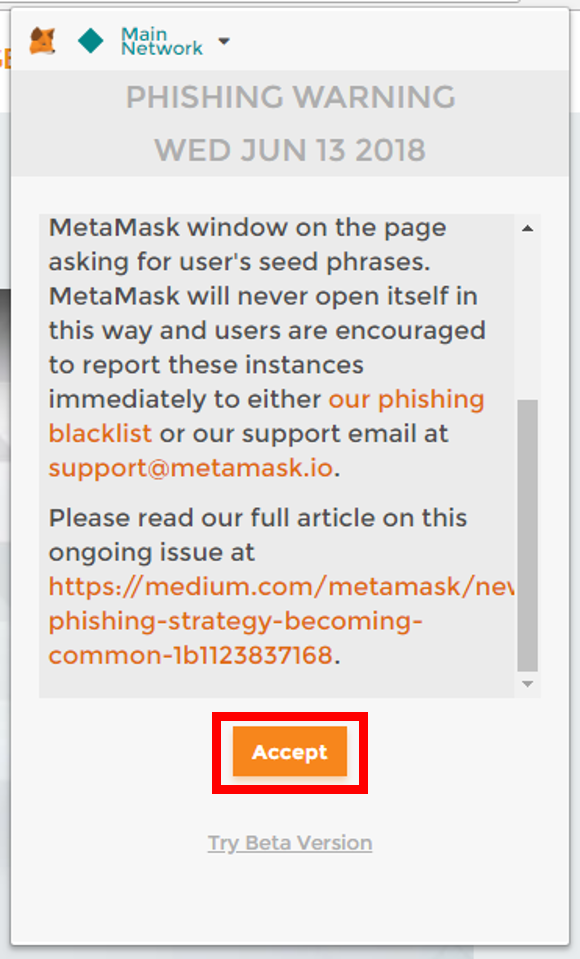

### （8）接著請在「New Password (min 8 chars)」及「Confirm Password」中輸入錢包的保全密碼 → 完成後點選【CREATE】。

註：MetaMask 錢包會在閒置一段時間後自動鎖定，鎖定後會要求輸入現在設定的密碼。

註：未來若想將已建立的錢包帳號還原，則可點選【Import Existing DEN】後來輸入「Seed Words」。

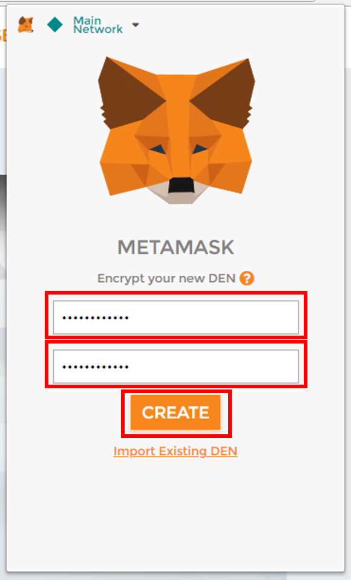

### （9）在建立全新錢包帳號（及地址）前，需建立對映此「錢包地址」的「私鑰（Private Key）」，這 12 組英文為「Seed Words」等同於該「錢包地址」的「私鑰」。
請先點選【SAVE SEED WORDS AS FILE】將「私鑰」keystore 儲存好 → 再點選【I'VE COPIED IT SOMEWHERE SAFE】進到錢包帳號管理介面。

注意：擁有此「Seed Words」的人將可控管此錢包內的所有財產，故必須妥善保管好。

註：這邊以此 Seed 為例：
```
people stand vicious engage cruel solve error power camera cousin maple use
```


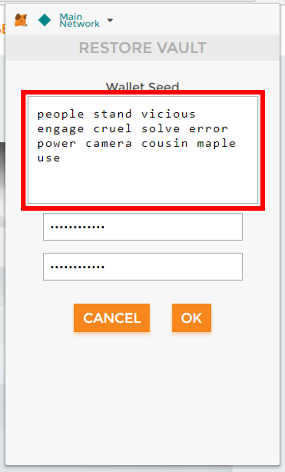

### （10）接著進到此畫面可看到「Account 1」即為目前選擇的錢包帳號，只要在瀏覽器中有要進行以太坊 Ethereum 交易，並呼叫 MetaMask 錢包時，就會以目前的「Account 1」為預設交易帳號。

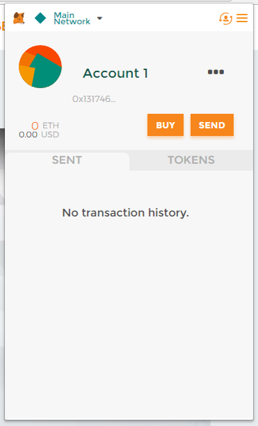

### （11）接下來要安裝單機版的 Ethereum Node，因為需要安裝第三方套件 Ganache，所以需先允許 Windows 作業系統可安裝第三方套件。

首先點選左下角【Windows 符號】→ 點選上方【設定符號】。


### （12）出現「Windows 設定」視窗，點選【更新與安全性】。

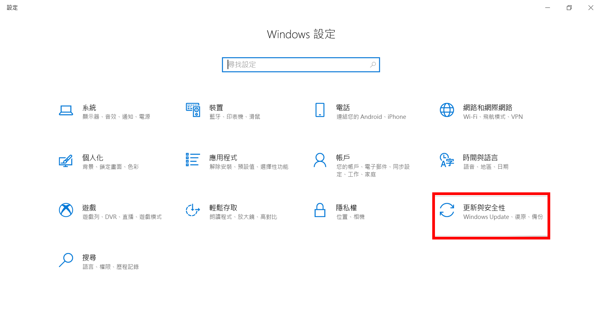

### （13）點選左側【開發人員專用】→ 點選允許安裝【側載應用程式】。

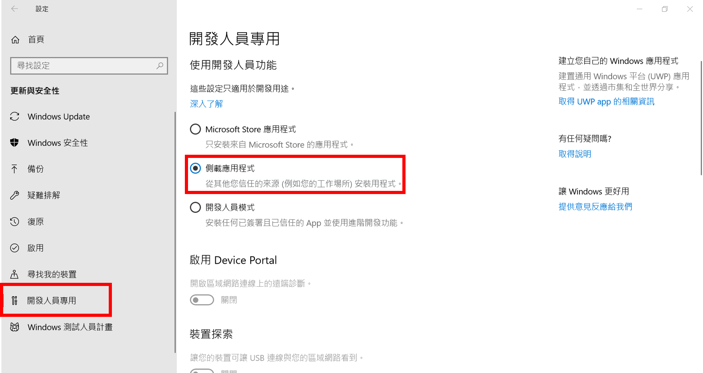

### （14）點選【是】完成設置→ 點選右上角【關閉符號】將「Windows 設定」視窗關閉。

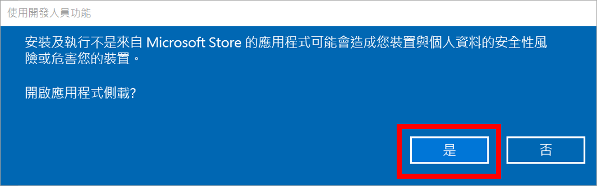

### （15）使用網頁瀏覽器連至「Ganache」官網：【[https://truffleframework.com/ganache](https://truffleframework.com/ganache)】→ 點選【DOWNLOAD（WINDOWS）】。

註：這邊將 Ganache 安裝程式下載至「%USERPROFILE%\Downloads\」目錄中。


### （16）至「%USERPROFILE%\Downloads\」目錄 → 點選【Ganache-*.exe】開始進行安裝。

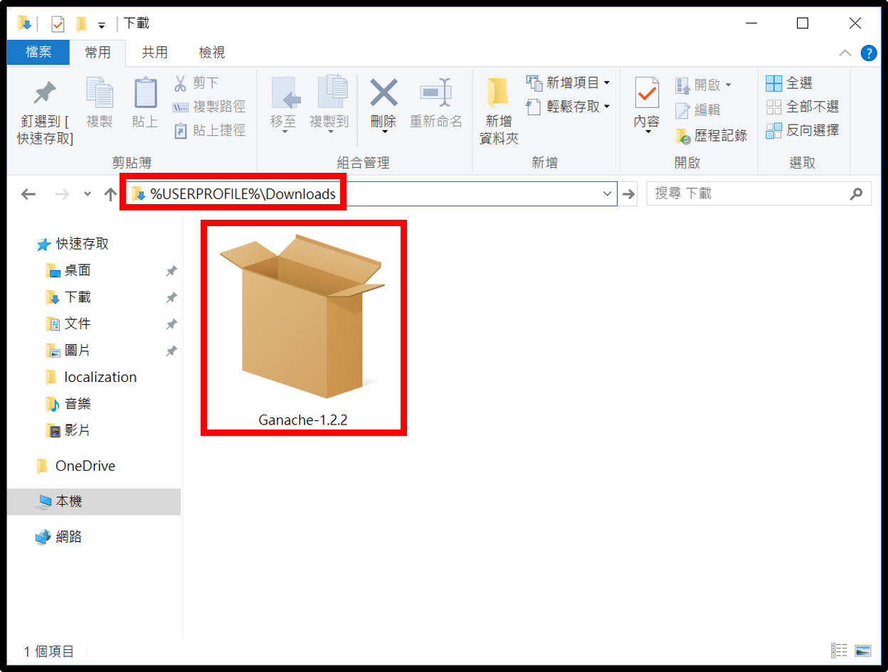

### （17）取消勾選【就緒時啟動】選項（稍後會在手動啟動）→ 點選【安裝】。


### （18）點選【執行】來確認這個是安全的安裝程式。


### （19）安裝完成後，先點選右上角【關閉符號】來關閉 Ganache 安裝程式。


### （20）點選左下角【Windows 符號】→ 點選【Ganache】來執行 Ganache。


### （21）取消勾選【Analytics enabled. Thanks!】選項，以拒絕將相關資訊傳送回官網（可在設定中重新開啟）→ 點選【CONTINUE】以啟動 Ganache。

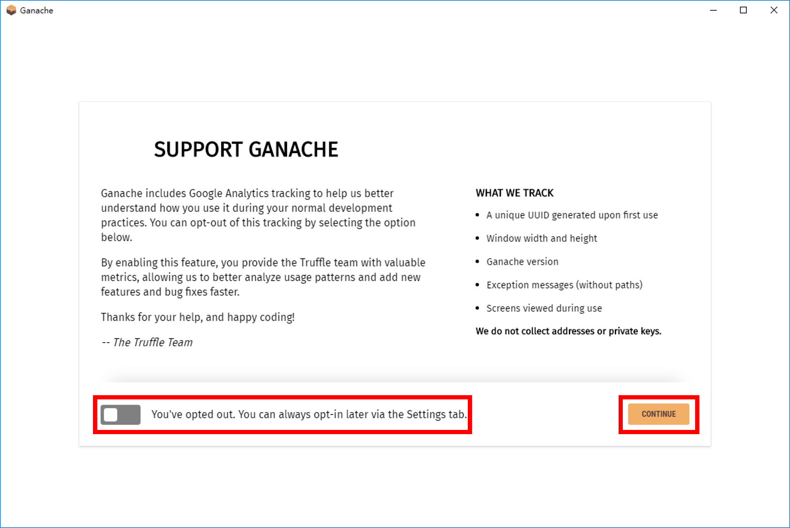

### （22）接下來我們要設置連入 Ganache 的連接埠，點選右上角【設定符號】。


### （23）在「PORT NUMBER」中將原本的「7545」改成通用的【8545】埠 → 點選【RESTART】使設置生效。


### （24）完成之後接著要使用 Metamask 連接至 Ganache，點選第一組帳號右側的【Show Keys】鈕。

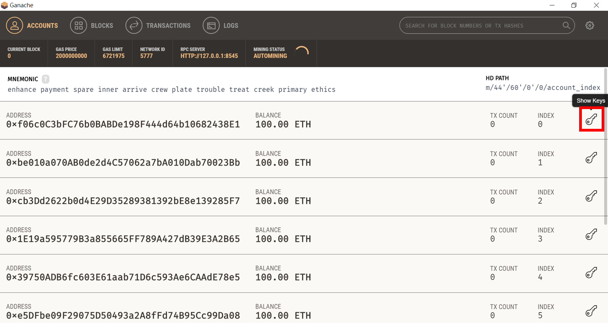

### （25）使用滑鼠將顯示的 64 個私鑰字元圈選起來 → 點選鍵盤上的【Ctrl】+【C】複製 → 點選【Done】關閉視窗。

註：這邊以此 Private Key 為例：
```
d448043bd8e72e23bff14f5e8de97d45a17a0efaee19cc52bf76ebf95f675247
```


### （26）回到 Google Chrome 瀏覽器，點選右上角的【Metamask 符號】。


### （27）此時要連至 Ganache，點選左上角的【Main Network】→ 點選【Localhost 8545】即可連線上剛才設定連入 8545 埠的 Ganache 了。


### （28）再來要將剛才複製的 Account 匯入 Metamask，點選右上角【改變 Account 符號】→ 點選【Import Account】。


### （29）在「SELECT TYPE」中點選【Private Key】→ 並且在「Paste your private key string here」中填入剛才複製的【64 個私鑰字母】→ 點選【IMPORT】。


### （30）可以發現我們成功的將 Ganache 的帳戶匯入，並且擁有預設的 100 顆 ETH 幣了。

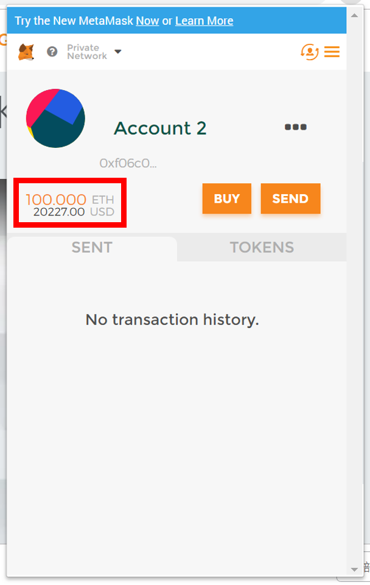

### 後記

完成了將 Matamask 連接至 Ganache 後，因為 Ganache 是自己建立的以太坊測試節點，我們甚至還可以自訂帳號數量，以及帳號的以太幣數量，就不用像稍早發佈的[在測試網發行 ERC20 的文章](https://steemit.com/rinkeby/@oneleo/rinkeby-erc20-erc20-token)，還需要到特定的網站來要取有限的以太幣了，大大減少開發智能合約的開發時間。

--------------------------------------------------

Donate ADA：
DdzFFzCqrhsup2Q4nnhKJJZ5BRuPkYUSPqDJn72t2dtHtVqsz5kQQmopMQR16Sv9qS5NC4w8Kv5P8XrDH2n2FD2akxtrntjc8hbgAmTz