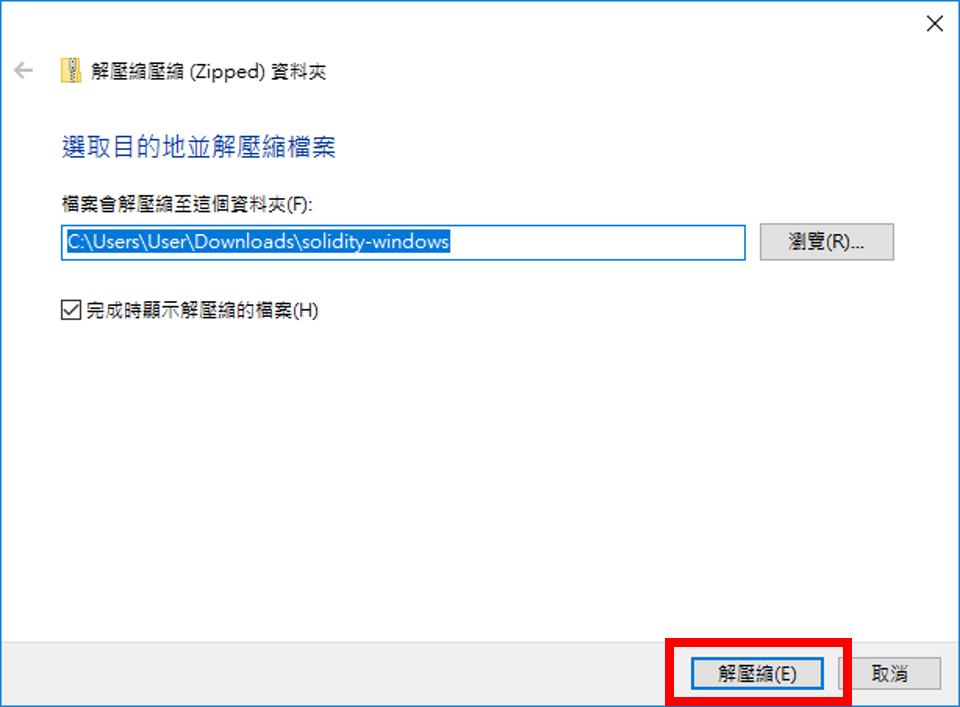
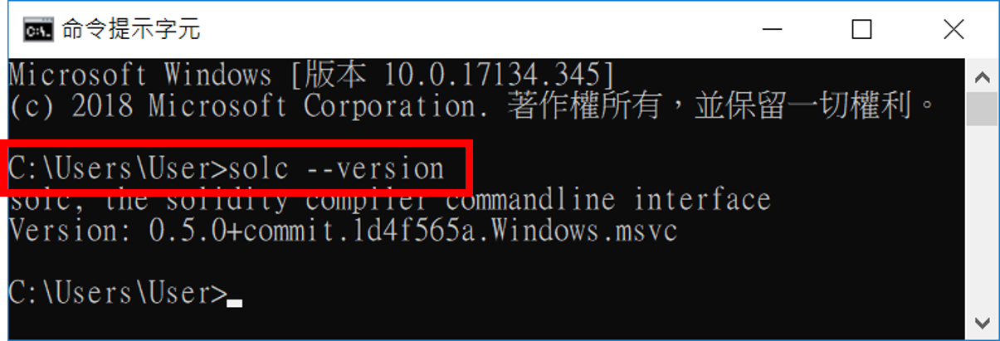

## 在 Windows 10 作業系統內建置 solidity 編譯環境

### 緣由

### （1）建立 Solidity 編譯環境。

- 至 Solidity Compiler 官網 [https://github.com/ethereum/solidity/releases](https://github.com/ethereum/solidity/releases)，並點選【solidity-windows.zip】開始下載（預設是下載到 `%USERPROFILE%\Downloads` 資料夾內）。


- 檔案下載後，滑鼠點選【solidity-windows.zip】→ 點選【解壓縮全部】。


- 點選【解壓縮】。



- 接著會自動將解壓縮後的資料夾開啟，將檔案全選後 → 點選【剪下】


- 假設目前 Windows 內已安裝 Go Langue 程式（可參考[這篇](../SetupGoEthereumEnvironment)），而「%GOPATH%\bin」此環境變數會在安裝 Go Language 時設置進「path」環境變數內，所以這邊將剛才剪下 solc 編譯程式的檔案【貼上】至【%GOPATH%\bin】內，使得可以直接在命令提示字元（%WINDIR%\system32\cmd.exe）程式內直接使用最新版的 solc 編譯程式。


- 開啟命令提示字元（%WINDIR%\system32\cmd.exe）程式


- 輸入下列指令測試 solc 是否有安裝成功：

```
> solc --version
```

