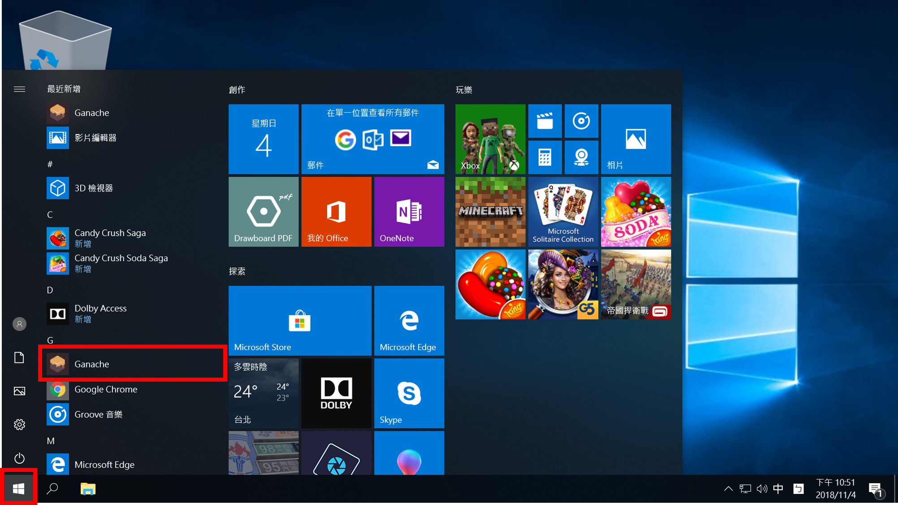

# Homework 3
> 作業位址：[Homework 3](https://docs.google.com/presentation/d/1UysleW9us6mzP-k8Y9yAd1xFV6vpi0rtXeZ0UnlsHAs/)
> 程式範例：[Sample Code](https://gitlab.com/HappyCodingFriend/HW3-Example)

## 0、環境建置

- 【安裝筆記】在 Windows 10 作業系統內建置 Node.js 開發環境請參考[本篇文章](../Homework_1/SetupNodeEnvironment)。
- 【安裝筆記】在 Windows 10 作業系統內建置單機版 Ethereum 節點 Ganache 請參考[本篇文章](../Homework_2/SetupGanacheEnvironment)。
- 【安裝筆記】在 Windows 10 作業系統內建置 go-ethereum 開發環境請參考[本篇文章](../Homework_2/SetupGoEthereumEnvironment)。
- 【安裝筆記】在 Windows 10 作業系統內建置 solidity 編譯環境請參考[本篇文章](../Homework_2/SetupGoEthereumEnvironment)。

## 0、作業說明

- 本作業以助教的 Sample Code 作為延伸，並在 Ganache Private Net 操作為主。
- 本作業以作業 2 為基底，建立一介面供使用者方便操作。

## 1、部署及進行操作

- 下載專案：

```
$> git clone https://github.com/oneleo/201809-Ethereum-DApp-Development-Homework.git
```

- 進入作業 3：

```
$> cd /d .\201809-Ethereum-DApp-Development-Homework\Homework_3
```

- 執行 Ganache Private Net



- 進行編譯及執行

```
$> npm install
$> npm start
```

- 使用瀏覽器進入 [http://localhost:3000/](http://localhost:3000/)


